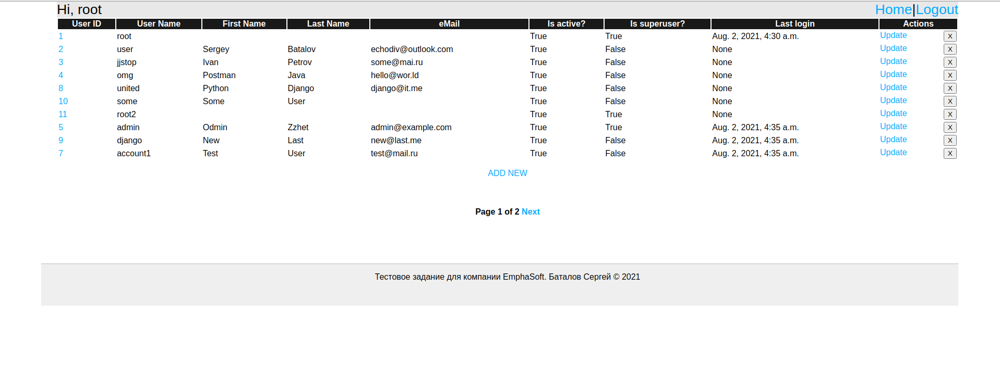
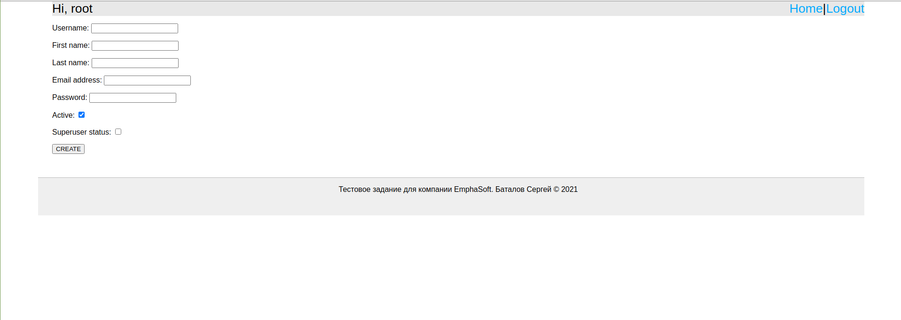
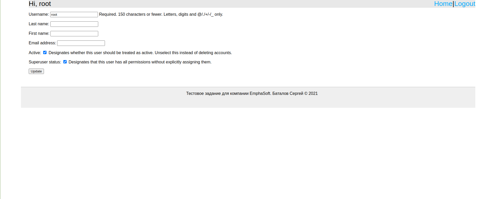

# Тестовое задание
### Accounts
Модуль предоставляет возможность внесения пользователей в систему, редактирования их учётных данных,
а так же удаление из системы аккаунтов пользователей

Для работы в модуле необходимо создать пользователя инструментами разработки
и авторизоваться в системе.

Модуль содержит три экрана:
1. Список пользователей
2. Добавление пользователя
3. Редактирования пользователя

#### 1. Список пользователей
Служит для постраничного вывода информации об аккаунтах



#### 2. Добавление пользователей
Служит для внесения нового пользователя в систему



#### 3. Редактирования пользователя
Служит для редактирования учетных данных конкретного пользователя

`!ВНИМАНИЕ! через данных экран нельзя изменить пароль от аккаунта`

### API
Реализует api для доступа управления аккаунтами

Для доступа к api необходимо выполнить авторизацию и прикрепить токен к заголовкам последующих запросов
```bash
# пример авторизации в сервисе
curl -X POST -H 'content-type: application/json'  \
--data '{"password":"1", "username":"root"}' \
http://0.0.0.0:8000/api-token-auth/
# {"token":"209f7dfaf8bdeecc95edf4b64329d46e1d121eac"}
# дальнейшие запросы с прикрепленным токеном
curl -H 'content-type: application/json'  \
--data '{"password":"1", "username":"root"}' \ 
http://0.0.0.0:8000/api-token-auth/
# {"id":1,"username":"root","first_name":"","last_name":"","is_active":true,"last_login":"2021-08-02T04:30:52.913668Z","is_superuser":true}
```
[Спецификация open api](./docs/openapi-schema.yaml)


## Разворот для локального тестирования
```bash
# собрать docker контейнеры и запустить
sudo docker-compose up -d --build
# остановить и удалить собранные образы
sudo docker-compose down -v
```
## Разворот на продуктовом сервере
```bash
# собрать docker контейнеры и запустить
sudo docker-compose -f docker-compose.prod.yaml up -d --build
sudo docker-compose -f docker-compose.prod.yaml exec web python manage.py migrate
sudo docker-compose -f docker-compose.prod.yaml exec web python manage.py collectstatic

# остановить и удалить собранные образы
sudo docker-compose -f docker-compose.prod.yaml down -v

```
Продуктовый разворот включает в себя [nginx](./nginx/nginx.conf)